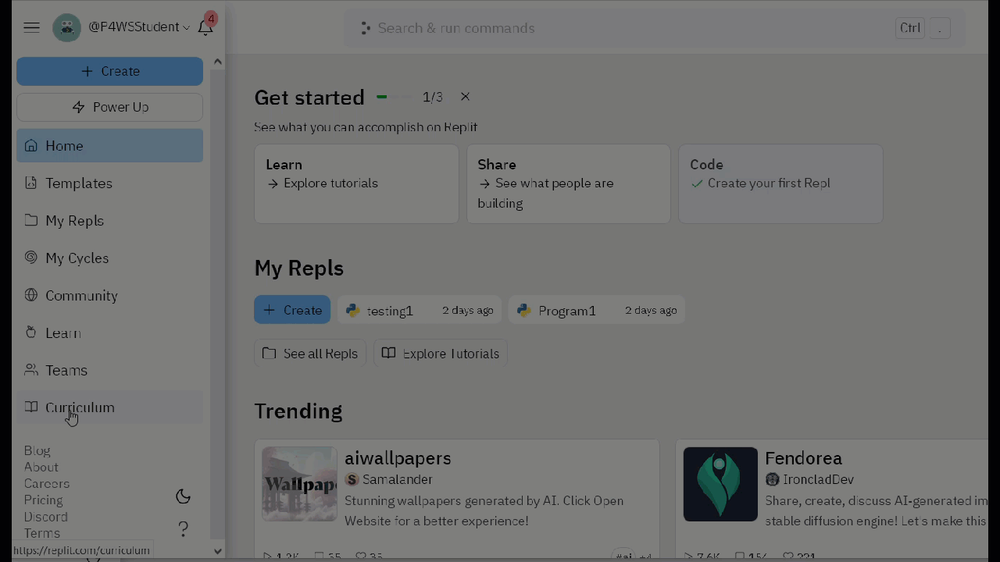

# Introduction
The CMU Graphics library enables you to draw shapes, images, and make animations and games with Python. It is a fun and visual way to learn how to code with Python.

This tutorial will get you started drawing shapes and making simple pictures on the Canvas. As you expand your skills further, you will be able to make your objects move and interact with each other, and the user, as you would expect in games.

# Choose the CMUGraphics template
To use CMU Graphics with Replit, you must choose the **Python-CMUGraphics template** when you create your Repl.


# Don't Delete the Code!
Look in main.py of this Repl and you can see that the first line is
```from cmu_graphics import *```
and the last line is
```cmu_graphics.run()```

You must write all your code *in between* these two lines.

**DO NOT change or delete the first and last lines**, or your Repl won't run.

# Take Care with Spelling and Capitalisation!
As you write code in CMUGraphics-Python, you need to take care to get your syntax correct.  Your code will give an error if you use ```circle``` instead of ```Circle```.
As a general rule, shape names will start with capitals, their properties will be in camelCase ie start with a lower case letter and use a capital for each word within the name eg ```borderWidth```.
