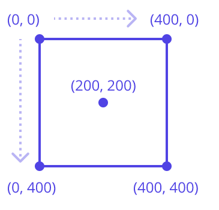

# Canvas and Background
*(1:38 in video)*

The CMU Graphics Canvas is a 400 x 400 grid. 

Objects are placed on the canvas using (x,y) coordinates, with (0,0) being the top left corner. 

The centre is at (200,200)

---
# Fill the Background with Colour!
The default background colour is white. Let's make things more colourful!

This code will set the background to be lime green:

```app.background = 'limegreen'```
---
# What Colours Can I Use?
There are plenty of colours to choose from.  This page will show you all the colour names that you can use.

https://academy.cs.cmu.edu/docs/builtInColors 

---
 
Try out some different coloured backgrounds for yourself.