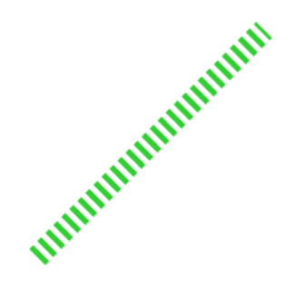

# Lines and Labels
*(9:48 in video)*
## Lines

This code draws a line from the point (x1, y1) to the point (x2, y2)

```Line(x1, y1, x2, y2)```

Lines have some special properties including: 

- dashes (either True or False)
- lineWidth (any number bigger than 0)

```Line(100, 300, 300, 100, fill='limeGreen', lineWidth=20, dashes=True)```


---
## Labels
Labels are a way of drawing text.

```Label(value, centerX, centerY)```

```value``` is the text drawn by the Label. 
Label values must be strings and included in quotes or you will get a syntax error.

Labels have lots of extra properties we can use. Here is a list of all of them:

  - Size: A number bigger than 0.
- bold: Either True or False
- italic: Either True or False
- font: Any of the following values: arial, monospace, caveat, cinzel, montserrat, grenze, sacramento, orbitron (Note that fonts do not appear to work on Replit)

```Label('WOOHOO!',250,250, fill='red',font='monospace', size=60, bold=True)```


Have fun with lines and labels on your Canvas.