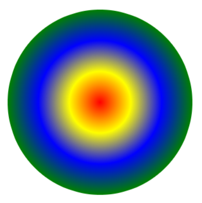
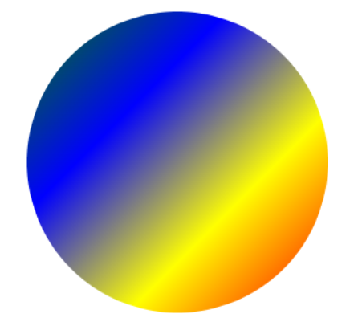

# Opacity, Colours and Gradients
*(10:04 in video)*
Opacity is how 'see through' an object is.  It can have values from 0 to 100.

```Rect(230,130, 150,100, fill='saddleBrown',opacity=60)```

---
## Colour Names
All the colour names you can use can be found here:
https://academy.cs.cmu.edu/docs/builtInColors 

---
## RGB Colours
Instead of the colour names, you can also use rgb colours. The RGB color value is a mix of three colour components. R is red, G is Green, and B is blue. Each of the color components (R, G, B) is a value between 0 and 255 as integers.

```Circle( centreX, centreY, radius, fill=rgb(255,0,0)```
would make a red circle because there is no green or blue in it. 

---
## Gradients
Gradients are when one colour blends into another colour.  If you don't say where to start, it will go from the centre to the outside of the shape. Gradients can have as many colours as you want in them.

```Circle(200,200,150,fill=gradient('red','yellow','blue','green'))```


### Starting point
You can start your gradient at 
- top-left
- top
- top-right
- left
- center
- right
- bottom-left
- bottom
- bottom-right
- 
```Circle(200,200,150,fill=gradient('red','yellow','blue','green',start='bottom-right'))```



Knock yourself out playing with colours and gradients!!