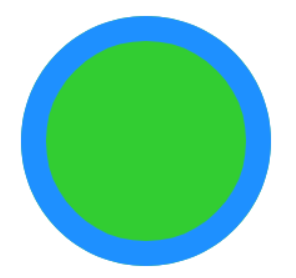
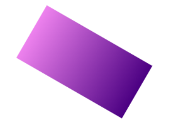

# Borders and Rotations
*(11:48 in video)*
## Borders
You can add a border around any shape by using:

fill='innerColor', border='borderColor', borderWidth=2

```Circle(300, 300, 50, fill='limeGreen', border='dodgerBlue', borderWidth=20)```


### No Fill
You can use ```fill=None``` if you just want the border for your shape, like this:

```Circle(300, 300, 50, fill=None, border='dodgerBlue', borderWidth=20)```

**Note**: You need to put a border on shapes that have no fill, otherwise you won't be able to see them!

---
## rotateAngle Property
This rotates any shape.  The number we use is the number of degrees that we want to rotate the shape clockwise.  Its value can be 0 to 360

The shape rotates around its centre point.

``` Rect(80, 80, 200, 100, fill=gradient('violet', 'indigo', start='left'), rotateAngle=30) ```




Put a different coloured border around a shape, then rotate it. 

---
## Looping Fun
*(12:28 in video)*

By using loops, you can repeat your shape rotations

Try out this code for yourself:

```for i in range (10): ```

>```Rect(80, 150, 200, 100, fill=gradient('violet','indigo'), rotateAngle=36*i)```