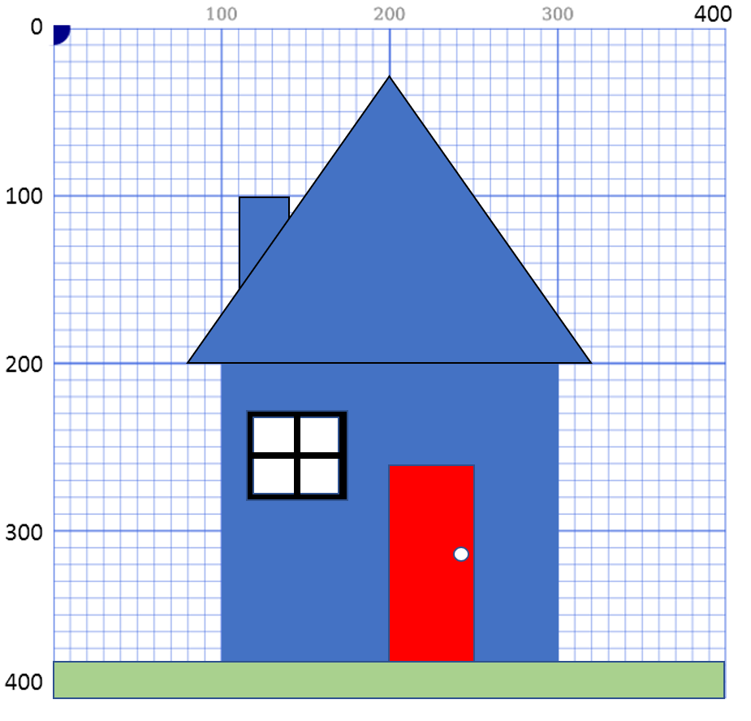
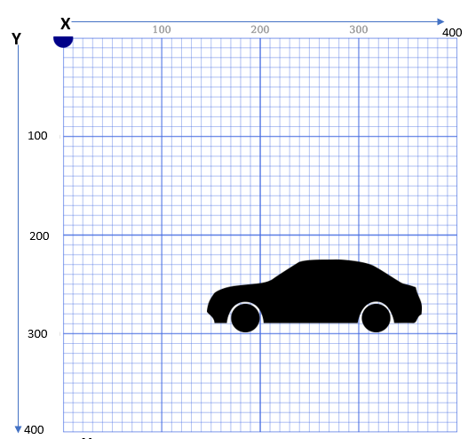
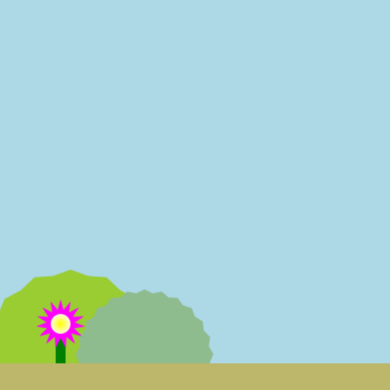

# Starter Templates
*(13:21 in video)*
It can be helpful to draw out your image on a grid before you start coding.
### Print a pdf
You can download a printable pdf of the drawing grid from here:
https://1drv.ms/u/s!Ar7N6F9OM8xUjIRTUhEBSwnJ33r4mg?e=TzQtEc 
### Use Microsoft Word
You can also use Word drawing tools to draft your picture. Download this Word file and use the drawing tools to draft out your scene:
https://1drv.ms/w/s!Ar7N6F9OM8xUjIRUZRoED7CAcTkYyQ?e=AETjkJ 

---
You can even 'cheat' and download a silhouette and paste it onto your Word grid.  (Make sure you choose to float the image in front of text.) Then you can just read off the coordinates that you want.

---
## Butterfly Starter
I have drawn a base for a butterfly.
Fork this repl and decorate the butterfly.
Add in a body, head, antennae and colourful decorations on the wings.

https://replit.com/@P4WSStudent/Butterfly-Starter#main.py 

---
## Garden Starter
Here is a starter for a garden
Fork it and try adding in a tree, bird, sun, more flowers, an animal, a building of some sort... whatever you want!

https://replit.com/@P4WSStudent/Garden-Starter

